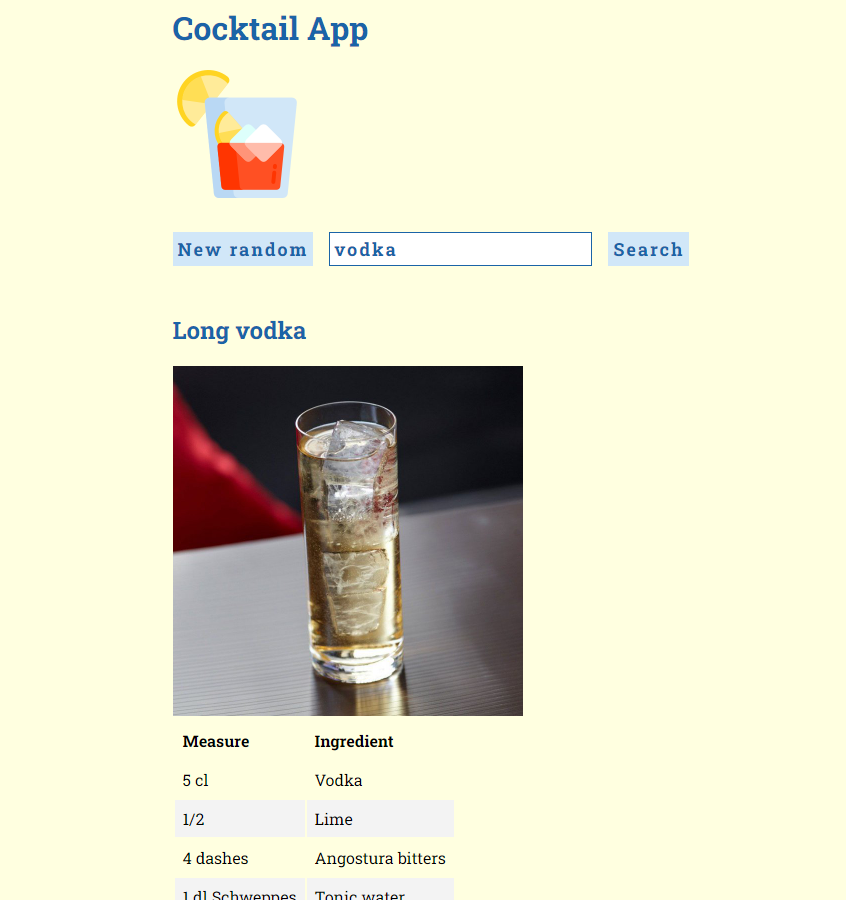

# Cocktail App

## Available Scripts

1. Run `npm install` in current directory to install the Node packages.
2. Run `npm install` in `/client` directory to install the Node packages.
3. Execute `npm start` in current folder to run the backend app.
4. Execute `npm start` in `/client` folder to run the frontend app.
5. Open [http://localhost:3000](http://localhost:3000) to view it in the browser.

## Known bugs

Built version has error when using API calls, development version is recommended to use.

## Screenshot

The app looks like this.

## Project description 

The project can retrieve information about drinks and cocktails from [TheCocktailDB](https://www.thecocktaildb.com/).

There are two features in this project:

- Get a random cocktail on reload and on clicking
- Search for a specific cocktail by name

